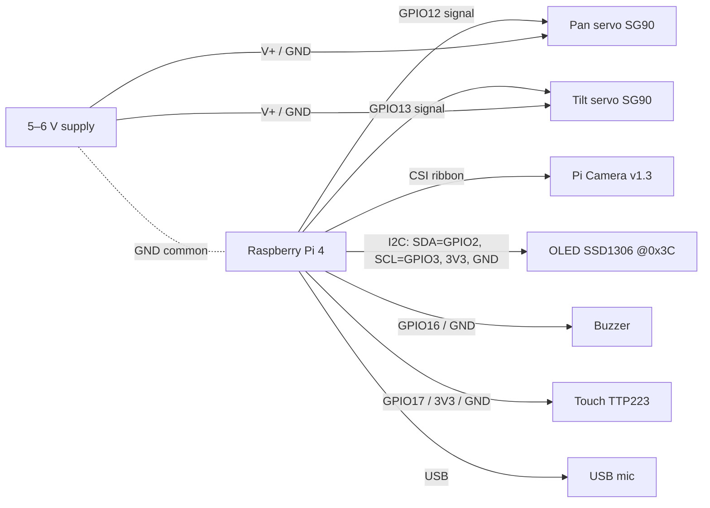

# 06 — Operations Guide (as-built)

How the running Peekabot is put together, how to deploy it, every tunable, and a
troubleshooting playbook for the issues we actually hit. This is the "as-built"
companion to the design docs (00–05).

## What's running

Four processes on the Pi (Raspberry Pi OS **Trixie**, 64-bit, Python 3.13),
coordinated over **Redis**:

| Process | systemd unit | Owns | Talks via |
|---------|-------------|------|-----------|
| **core** | `peekabot-core` | FastAPI + WebSocket, SQLite (sole writer), scheduler, serves the dashboard | REST/WS to browser; publishes `cmd.*`, reads `state:*` |
| **vision** | `peekabot-vision` | Pi camera, YuNet face detection, presence, MJPEG preview | publishes `cmd.servo.target`, `state:camera`, `presence` |
| **hardware** | `peekabot-hardware` | the servos + OLED + buzzer (sole GPIO/I2C owner) — arbiter, hardware PWM, animated eyes | subscribes `cmd.servo.*` / `cmd.buzzer.beep`, publishes `state:servo`, `state:oled` |
| redis | `redis-server` | the bus + state cache | — |

Design rules that matter operationally:
- **Only `hardware` touches the servos** (D2). `core` never opens GPIO — it
  publishes commands. This is why `hardware_backend: real` is safe with core running.
- **Only `core` writes SQLite** (D4). Other processes publish events.
- **Redis is the bus** (D3): `cmd.*` = commands, `state:*` = latest-value cache.

## The stack we ended up on (and why)

| Concern | Choice | Why not the "obvious" option |
|---------|--------|------------------------------|
| OS | Raspberry Pi OS Trixie 64-bit Lite | current release; Python 3.13 |
| Servo signal | **hardware PWM** on GPIO 12/13 via `rpi-hardware-pwm` | software PWM (gpiozero/lgpio) jitters; **pigpio was removed in Trixie** |
| Face detection | **OpenCV YuNet** | **MediaPipe doesn't support Python 3.13** |
| Camera capture | `picamera2` | fine on 3.13 (only MediaPipe wasn't) |
| Tracking control | **position-step** (move-and-settle) | velocity control hunts — camera rides on the servo (feedback lag) |
| Bus | Redis | needed once vision/hardware became separate processes |

See the decision log in [00-overview.md](00-overview.md#decision-log) (D3, D6, D9,
D10, D11).

## Install (one line, fresh Pi)

On Raspberry Pi OS **Trixie (64-bit)**, SSH in and:
```bash
curl -fsSL https://raw.githubusercontent.com/sarthakgarg814/Peekabot/main/install.sh | bash
```
`install.sh` is idempotent (re-run to update) and does the lot: apt deps, Redis,
`picamera2`/OpenCV, gpiozero/lgpio, clones to `~/peekabot`, fetches the YuNet model,
builds the dashboard (installs Node), creates the three service venvs
(`.venv` / `.venv-vision` / `.venv-hardware`), writes `config/local.yaml`
(`bus_backend: redis`, `hardware_backend: real`), adds the hardware-PWM overlay,
and installs + starts the `peekabot-core` / `-vision` / `-hardware` systemd units.
Reboot once afterwards for the PWM overlay + camera. Then it's at
`http://peekabot.local:8000` (login `peekabot`).

## Authentication

The dashboard and every `/api/*` endpoint (and the `/ws` socket) are
password-protected — single-user, meant for a personal device.

- **Default password:** `peekabot`. Change it in the dashboard under **Account**
  (it stores a pbkdf2 hash in the `auth.password_hash` setting).
- **Token:** login returns an HMAC-signed bearer token (30-day). The browser keeps
  it in `localStorage` and sends `Authorization: Bearer …`; the socket passes it
  as `?token=`. Signing secret: `config/.session_secret` (per-machine, gitignored,
  rsync-excluded — so each device has its own and tokens don't cross machines).
- **Public endpoints** (no token): `GET /api/health`, `POST /api/auth/login`,
  `GET /api/auth/status`. Everything else 401s without a valid token.
- Forgot the password? Delete the `auth.password_hash` row (or the whole DB — it's
  a cache) to fall back to the `peekabot` default:
  `sqlite3 ~/peekabot/peekabot.db "delete from settings where key='auth.password_hash'"`.

## Wiring

Camera is CSI ribbon; everything else is on the 40-pin header. **Servos need a
separate 5–6 V supply with its ground tied to the Pi's ground** (don't run two
SG90s off the Pi 5 V rail under load).

| Accessory | Pi pin (BCM) | Physical pin | Notes |
|-----------|--------------|--------------|-------|
| Pi Camera v1.3 | — | CSI ribbon port | not GPIO |
| OLED SSD1306 (0x3C) | SDA=GPIO2, SCL=GPIO3 | 3, 5 | + 3V3 (pin 1) + GND |
| Pan servo (SG90) | GPIO12 (signal) | 32 | hardware PWM; V+/GND to external 5–6 V |
| Tilt servo (SG90) | GPIO13 (signal) | 33 | hardware PWM; V+/GND to external 5–6 V |
| Buzzer (active) | GPIO16 | 36 | + to GPIO16, − to GND |
| Touch sensor (TTP223) | GPIO17 | 11 | OUT→17, VCC→3V3, GND→GND |
| USB microphone | — | USB port | |



Pins are config (`config/defaults.yaml` runtime): `servo_pan_pin`,
`servo_tilt_pin`, `buzzer_pin`, `touch_pin`.

## Deploy workflow

Frontend is **built on the laptop** and rsynced (D5) — the Pi never runs npm.

```bash
# One-time on the Pi (in order):
./scripts/setup-pi.sh              # core: venv + deps + peekabot-core service
./scripts/setup-vision-pi.sh       # redis + camera/opencv + peekabot-vision, flips bus->redis
./scripts/setup-hardware-pi.sh     # gpiozero/lgpio + peekabot-hardware (mock servo)
./scripts/setup-hardware-pi.sh --real   # once servos are wired: hardware PWM + real servo

# Every change after that:
./scripts/deploy-to-pi.sh peekabot@peekabot.local      # laptop: vite build + rsync
ssh peekabot@peekabot.local 'sudo systemctl restart peekabot-core peekabot-vision peekabot-hardware'
```

The Pi runs an **editable install** (`pip install -e backend`), so a redeploy +
service restart picks up code changes with no reinstall.

Dashboard: **http://peekabot.local:8000**

## Configuration model

Three layers, lowest to highest precedence:

1. **`config/defaults.yaml`** — `runtime:` (ports, pins, backends) read before the
   DB exists, and `settings:` seeds for first boot.
2. **`config/local.yaml`** — per-machine `runtime:` overrides (gitignored, **not**
   rsynced). The Pi sets `bus_backend: redis` and `hardware_backend: real` here so
   a redeploy never clobbers them.
3. **DB `settings` table** — the live-tunable values. **This is the source of
   truth at runtime**, edited from the dashboard Settings page.

> **Seeding is insert-only.** `defaults.yaml` seeds a setting *once*; changing a
> default later does **not** update an existing DB row (so your edits survive).
> To change a value on a running Pi, edit it in **Settings**, not the YAML. (This
> is what caused the "servo frozen" bug — a stale `kp: 0.08` from the very first
> seed.)

**Live tuning path:** edit in Settings → `core` writes the DB + publishes
`event.settings.changed` → `core` re-mirrors to `state:vision.config` /
`state:servo.config` → vision/hardware poll (~2 s) and apply. No restart.

## Settings reference

### camera (vision service)
| Key | Default | Effect |
|-----|---------|--------|
| `camera.tracking_enabled` | true | **off = servos freeze** (no follow, no home-drift). Manual/Center still work. |
| `camera.preview_enabled` | false | MJPEG video stream on port 8090 (privacy: off by default) |
| `camera.track_fps` | 10 | processing FPS while a face is present (CPU vs responsiveness) |
| `camera.idle_fps` | 2 | processing FPS when away (idle CPU saving) |
| `camera.detect_width` | 256 | detection downscale px (smaller = less CPU, less range) |

### servo (hardware service)
| Key | Default | Effect |
|-----|---------|--------|
| `servo.track_gain` | 0.5 | fraction of the geometric error corrected per frame (0.5 = halve error/frame). Higher = snappier, may overshoot |
| `servo.fov_pan` / `servo.fov_tilt` | 54 / 41 | camera field-of-view (deg). Sets how many degrees to move per unit error. Too high → overshoot |
| `servo.deadzone` | 0.04 | ignore error smaller than this (settle). Raise if a servo micro-jitters at rest |
| `servo.max_speed` | 120 | slew rate (deg/s) — how fast it physically moves to the target |
| `servo.limit_deg` | 80 | ± angle clamp |
| `servo.pan.invert` / `servo.tilt.invert` | false | flip if a servo moves the WRONG way (camera-on-gimbal usually needs true) |
| `servo.pan.offset_deg` / `servo.tilt.offset_deg` | 0 | mechanical center trim |
| `servo.recenter_after_s` | 3.0 | face lost this long → drift home (only when tracking enabled) |

### oled (hardware service)
| Key | Default | Effect |
|-----|---------|--------|
| `oled.mode` | eyes | `eyes` = animated robot eyes; `status` = text (time/CPU/temp/tracking/servo) |
| `oled.emotion` | auto | `auto` = happy when a face is present, sleepy when away (and mood-driven later); or force `happy`/`neutral`/`sad`/`angry`/`surprised`/`sleepy` |
| `oled.stats_enabled` | true | flash the icon system-stats screen periodically while present |
| `oled.stats_every_s` / `oled.stats_dwell_s` | 30 / 4 | show stats every N sec, for M sec |

### water (core reminder engine)
| Key | Default | Effect |
|-----|---------|--------|
| `water.reminder_enabled` | true | timed hydration nudge |
| `water.interval_min` | 60 | remind every N minutes |
| `water.only_when_present` | true | **only fire when a face is present** (the whole point) |
| `water.buzzer_enabled` | true | beep the buzzer when a reminder fires |
| `water.daily_goal` | 8 | glasses/day, for the dashboard progress bar |
| `water.active_start` / `water.active_end` | 09:00 / 21:00 | only remind between these local times (no night reminders) |
| `water.active_days` | [0..6] | weekdays it's active (0=Mon..6=Sun) |
| `water.reset_hour` | 0 | hour the daily count resets (local) |

All water times are **local** (the Pi's clock); water events store local time.

A reminder fires the buzzer (`cmd.buzzer.beep`), a **"drink water" animation on
the OLED** (`state:oled.alert`, ~8 s, over the eyes), a yellow LED, and a
dashboard toast. "I drank water" / the interval both reset the timer.

### calendar (Google, read-only)
| Key | Default | Effect |
|-----|---------|--------|
| `calendar.enabled` | false | turn on Google Calendar sync (needs credentials) |
| `calendar.sync_min` | 15 | sync interval (live — self-paced, no restart) |
| `calendar.reminder_min` | 5 | fire a meeting alert this many minutes before |
| `calendar.hide_busy` | false | hide detail-less shared "Busy" work blocks |
| `calendar.meeting_mode` | true | also alert (flashing "NOW") when a meeting starts |
| `calendar.enabled_ids` | [] | which calendars to include (`[]` = all visible); edit via the Calendar page checkboxes |

All calendar config is editable on the **Calendar page** (connect flow + settings +
per-calendar selection). Events are tagged **Personal** (primary) vs their shared
calendar name. The OLED shows a shaking-bell "in N min" for upcoming meetings, a
flashing "NOW" at start, and the next event on the stats screen footer.

**Connecting (free, no billing) — all from the dashboard:** Google Cloud → enable
Calendar API → OAuth consent (add yourself as a test user, set *In production* to
avoid 7-day token expiry) → create a **Desktop-app** OAuth client → download JSON.
Then on the **Calendar page**: (1) upload the client-secret JSON, (2) click the
authorization link + approve, (3) paste back the redirected URL/code. The token is
saved on the Pi (`config/google/`, gitignored + rsync-excluded so redeploys don't
touch it) and calendar auto-enables. `scripts/google-auth.py` remains as a
laptop-based fallback. A meeting within `reminder_min` fires the buzzer + an OLED
"MEETING" screen + a dashboard toast.

### runtime (config/defaults.yaml or local.yaml)
`hardware_backend` (mock\|real), `bus_backend` (inprocess\|redis), `redis_url`,
`servo_pan_pin` (12), `servo_tilt_pin` (13), `buzzer_pin` (16), `touch_pin` (17),
`preview_port` (8090),
`vision_track_fps`/`idle_fps`/`detect_width` (startup fallbacks), `frontend_dist`.

## Face-tracking, how it works

1. `vision` detects the face, computes normalized centering error `err_x/err_y`
   in `[-1,1]` (0 = centered), publishes `cmd.servo.target` (mode `error`) at
   `track_fps`.
2. `hardware`'s **arbiter** picks the owner by priority
   (`manual_test > center > face_tracking > idle`), then for a face-tracking
   sample computes an **absolute target**: `target = current + track_gain × err ×
   (FOV/2)`, slews to it (`max_speed`), and **holds** — no continuous motion.
3. Face within `deadzone` → no new target → servo settles.
4. Face gone `recenter_after_s` → drift home (if tracking enabled).
5. `camera.tracking_enabled = false` → vision stops sending targets and the
   arbiter freezes in place.

## Troubleshooting playbook

| Symptom | Cause | Fix |
|---------|-------|-----|
| `apt install pigpio` → no candidate | pigpio removed in Trixie | Use lgpio / hardware PWM (already the design) |
| MediaPipe won't install | no Python 3.13 support | We use OpenCV YuNet instead (D9) |
| Camera preview is **purple** | picamera2 "RGB888" is already BGR; double cvtColor | Fixed — no conversion in `PiCamera2Source` |
| Servo **buzzes/jitters** constantly | software PWM timing wobble | Hardware PWM on 12/13 + `pwm-2chan` overlay + reboot |
| Servo jitters only under load / Pi reboots | 5V brownout from servo current | External 5–6V supply, common ground, or a 470–1000 µF cap |
| Servo **won't move at all** on tracking, manual works | stale seed value (e.g. `kp 0.08`) OR service still on mock | Set the value in Settings; confirm `hw.real` in the hardware log; ensure the service was **restart**ed (not just `enable --now`) |
| Servo moves **opposite** to the face | camera-on-gimbal reverses direction | Flip `servo.pan.invert` / `servo.tilt.invert` |
| Tilt **micro-jogs** at rest | vertical error noisier than deadzone | Raise `servo.deadzone` (0.08–0.10) |
| Servo twitches erratically | loose signal/power jumper | Reseat the connector |
| Tracking **hunts / never settles** | velocity control / lag | Fixed — position-step control (D10); if still, lower `track_gain` |
| Preview enabled but no video | no `` was on the page / stream on :8090 | Fixed — Camera page embeds the stream when preview on |
| Dashboard dot red, "connecting…" | core error on the bus | `journalctl -u peekabot-core -n 30` |

### Handy commands
```bash
journalctl -u peekabot-hardware -f          # watch the arbiter
redis-cli get state:servo                  # current pan/tilt/owner
redis-cli get state:servo.config           # gains the arbiter is using
redis-cli get state:camera                 # fps / present / face err_x,err_y
systemctl is-active peekabot-core peekabot-vision peekabot-hardware redis-server
```

## Status / roadmap

- ✅ **M1** backend + dashboard skeleton
- ✅ **M2a** camera + YuNet face detection (17 FPS, CPU-tuned)
- ✅ **M2b** servo arbiter + hardware-PWM pan/tilt face-follow, tracking toggle,
  return-to-home
- ✅ **OLED** (0.96" I2C SSD1306 @ 0x3C) — **animated robot eyes** (blink, gaze
  toward the face, emotions) or a text status screen, rendered in a dedicated
  ~12 fps thread. Emotion is happy/sleepy on presence today; mood detection will
  drive it later.
- ✅ **Water reminder** (presence-gated, schedule, buzzer + OLED animation)
- ✅ **Google Calendar** (read-only OAuth from the UI, per-calendar selection,
  meeting reminders + OLED animation, next-event on the status screen)
- ✅ **Auth** (password login for dashboard + API, change password) + **one-line
  installer** (`install.sh`)
- ⬜ **Next:** mood detection (drives the eyes), LEDs (WS2812B), touch sensor +
  screen cycling, voice (wake word + STT)
